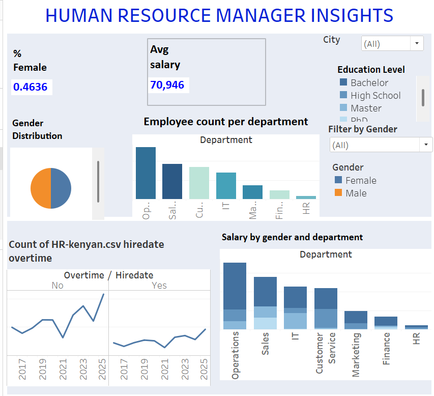
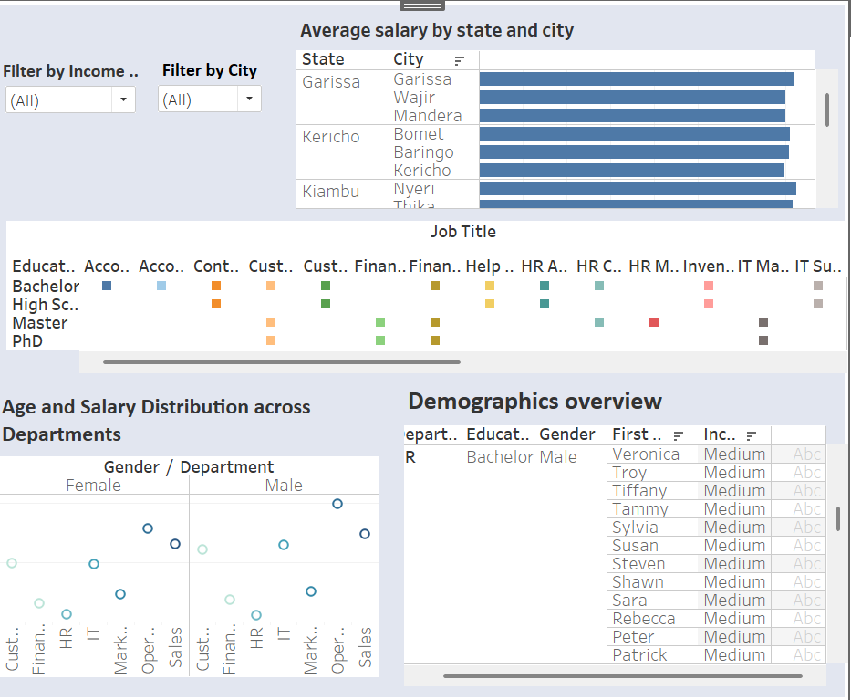

# tableau-hr-insights
HR analytics dashboard project using Tableau – summary insights, demographics, and income distribution
# 📊 HR Insights Dashboard – Tableau Project

This project focused on hands-on data visualization using Tableau. The goal was to analyze HR data and design an interactive dashboard for data-driven decision-making.

Link for the HR dataset and project brief : https://www.datawithbaraa.com/tableau/tableau-hr-project-thank-you/

## 🧠 Objectives
- Understand employee distribution and demographics
- Analyze salary trends, income levels, and gender balance
- Provide an interactive dashboard for HR managers

## 📁 Files Included
- `Hr insights tableau.twb` – Tableau workbook
- `Shirleen_Simon_Data_Tableau.docx` – Project report with methodology, measures, and dashboard explanation

## 📊 Dashboard Features
- Overview KPIs: Total Employees, % Female, Average Salary, Gender Ratio
- Demographics: Age, Gender, Department, Education
- Income Analysis: Salary distribution by department, gender, and income level
- Interactive employee directory with filters (Name, Gender, Role, Salary, etc.)

📁 [Download Tableau Workbook (OneDrive)](https://1drv.ms/u/s!AugnChb-ZnKTfjuBeepDDLcha1E?e=cH5ay1)

## 🌐 Tableau Dashboard

## 🧾 Report
📄 [Read Project Report](Shirleen_Simon_Data_Tableau.docx)

## 🌍 Portfolio Website
🔗 [Visit My Portfolio](https://shirleensimon.github.io)
